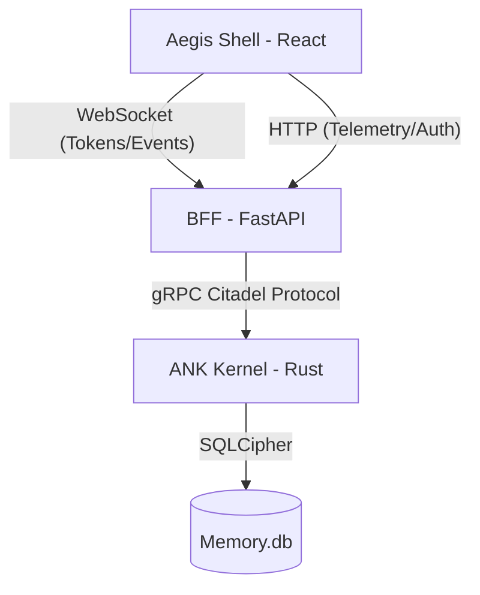

# 🛡️ Aegis Shell v0.1.0-Stable | Release Notes

## 🚀 Despliegue Exitoso: El Enlace Neural está Operativo

Es un honor anunciar el lanzamiento de la **Aegis Shell v0.1.0-Stable**, la interfaz gráfica de grado empresarial diseñada para orquestar el **Aegis Neural Kernel (ANK)**. Hemos construido un ecosistema que no solo es estéticamente superior, sino técnicamente impenetrable.

### 🏆 Hitos de Ingeniería (Ring 0 Ready)

*   **[SH-101] El Puente gRPC (BFF)**: Establecimos un puente asíncrono robusto usando FastAPI y `grpc.aio`, permitiendo una comunicación bidireccional de baja latencia con el Kernel en Rust.
*   **[SH-102] Cerebro Reactivo (Zustand)**: Implementamos un motor de estado optimizado para streaming de alta frecuencia, capaz de procesar pensamientos y telemetría sin degradación de la UI.
*   **[SH-103] Aegis Terminal**: Una interfaz de chat premium con soporte para Markdown GFM, renderizado diferenciado de Chain-of-Thought (CoT) y **Smart Auto-Scroll**.
*   **[SH-104] Telemetría y "The Orb"**: Creamos un centro de mando visual integrado. Gracias al orbe reactivo y las métricas desacopladas vía HTTP Polling, el operador tiene visibilidad total del pulso de la CPU, VRAM y el enjambre neural.
*   **[SH-105] Protocolo Citadel (Auth)**: Blindamos la Shell con un esquema de seguridad **Zero-Knowledge**. La derivación de llaves por SHA-256 asegura que Ring 0 solo sea accesible por personal verificado.

### 🏛️ Resumen de la Arquitectura

### 🥂 Felicitaciones al Equipo
Lead, su visión de una interfaz **Cyber-Minimalista** y técnicamente rigurosa ha sido la brújula de esta fase. El código entregado sigue los más altos estándares SRE: es predecible, seguro y escalable.

---

### 📡 Próxima Misión: Aegis Standard Library (Wasm Plugins)
Con la Shell terminada, estamos listos para dotar al Kernel de capacidades ejecutivas. Nos vemos en el repositorio `aegis-ank` para construir el futuro de los plugins autónomos.

**Operación Aegis Shell finalizada con éxito.**
*Antigravity | Senior Full-Stack Engineer*
